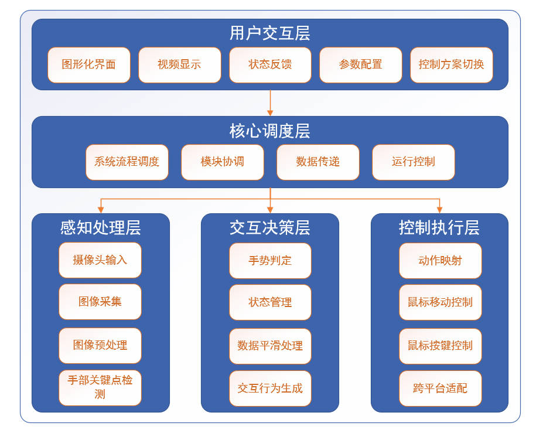
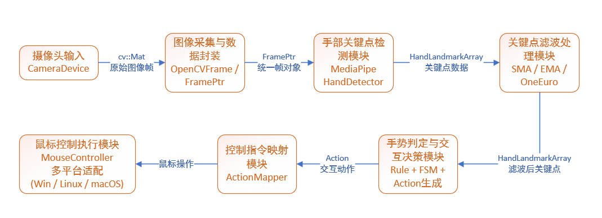

# VisionCursor

基于 OpenCV + MediaPipe + Qt 的手势鼠标控制系统。
目前仅支持windows平台，具有完整可用的gui界面。  
项目目标是将摄像头手部关键点识别能力转换为可配置的鼠标控制行为（移动、点击、滚动），并通过可视化界面完成调试与参数管理。

## 项目亮点
- 模块化流水线：`采集 -> 检测 -> 滤波 -> 状态机决策 -> 鼠标映射执行`
- 内置多套手势方案：`easy`、`advanced`、`tiktok`，同时可自定义手势控制方案
- 支持多种滤波器：`none`、`SMA`、`EMA`、`OneEuro`
- 提供 Qt 图形界面：监控页、参数设置页、方案控制页、信息页
- 配置文件自动落盘，便于复用与二次开发
- 提供单元测试与集成测试（包含大量环境自适应 `SKIP`）

## 项目演示与图示

### 1) 运行演示（demonstrate）


该 GIF 展示项目实时运行状态，包括手势识别、状态切换与鼠标控制效果。

### 2) 手部关键点识别（hand-landmarks）


该图展示 MediaPipe 输出的手部关键点结果，是后续手势判定与轨迹平滑的输入基础。

### 3) 分层架构图（architecture-overview）


该图对应 VisionCursor 的四层分工：
- 用户交互层：图形化界面、视频显示、参数配置与方案切换
- 核心调度层：统一管理系统流程、模块协同、数据传递与运行控制
- 感知处理层：摄像头输入、图像采集、预处理、手部关键点检测
- 交互决策层 + 控制执行层：手势判定与状态机决策，最终映射为鼠标动作执行

### 4) 端到端数据流图（pipeline-dataflow）


该图体现了项目实际运行的数据链路：
- `CameraDevice` 采集原始图像
- `OpenCVFrame / FramePtr` 统一帧对象
- `MediaPipeHandDetector` 产出 `HandLandmarkArray`
- 滤波模块（SMA / EMA / OneEuro）降低抖动
- `Rule + FSM + InteractionController` 输出 `Action`
- `ActionMapper` 映射到 `MouseController`
- `MouseController` 执行最终鼠标操作

## 技术栈
- C++17
- Qt（Widgets / Core / Multimedia / OpenGL / OpenGLWidgets）
- OpenCV 4.7（`opencv_world470`）
- MediaPipe C++（本地动态库方式接入）
- GoogleTest
- CMake 3.24+

## 目录结构
```text
vision-cursor/
├─ src/                    # 核心源码
│  ├─ vision/              # 摄像头与帧封装
│  ├─ mediapipe/           # 手部关键点检测
│  ├─ algorithm/           # 滤波算法
│  ├─ interaction/         # 规则、状态机、动作生成
│  ├─ mapping/             # 动作到鼠标事件映射
│  ├─ device/              # 平台鼠标控制封装
│  ├─ core/                # 编排器（总调度）
│  ├─ config/              # 配置读写与预设生成
│  └─ ui/                  # Qt 页面与交互
├─ tests/                  # 单元/集成测试
├─ docs/                   # 文档与图示
├─ resources/              # 图标、资源文件
└─ 3rdparty/               # 三方依赖（本地目录）
```

## 环境要求（推荐）
- Windows 10/11 x64
- CMake >= 3.24
- Qt 6.x（建议 6.8+，含 Widgets / Multimedia / OpenGL 组件）
- Visual Studio 2022（MSVC x64）或 Ninja + MSVC 工具链
- 已准备本地依赖目录：
  - `3rdparty/libmediapipe`（包含 `include/lib/bin/training_data`）
  - `3rdparty/opencv`（包含 `include/lib/bin`）
  - `3rdparty/googletest`

## windows下的编译与运行

### 环境
 注意由于github上传文件大小不能超过50MB，所以windows下需要手动配置openCV库并放到3rdparty文件下

### 1) 配置工程参考指令
```powershell
cmake -S D:\vision-cursor -B D:\vision-cursor\build -G "Visual Studio 17 2022" -A x64 -DCMAKE_TOOLCHAIN_FILE="C:\Qt\6.8.3\msvc2022_64\lib\cmake\Qt6\qt.toolchain.cmake"

```

### 2) 编译
打开：  `x64 Native Tools Command Prompt for VS 2022`
然后：  
```x64 Native Tools Command Prompt for VS 2022
cd D:\vision-cursor
cmake --build build --config Release
```

### 3) 启动
```powershell
.\build\bin\Release\VisionCursor.exe
```

## 配置文件说明

应用启动后会在运行目录生成配置内容：
- `config/core_config.json`
- `config/ControlPreset/easy.json`
- `config/ControlPreset/advanced.json`
- `config/ControlPreset/tiktok.json`

`core_config.json` 主要配置项：
- `camera`：设备名、分辨率、FPS、镜像
- `mediapipe`：阈值、复杂度、是否复用历史关键点
- `interaction`：方案名、滤波器与参数、控制关节点
- `mapper`：移动灵敏度、滚轮灵敏度、映射区域、移动模式

## 测试

本项目包含单元测试与集成测试，使用的是google的Gtest框架。

说明：

- 摄像头/训练数据相关测试在环境不满足时会 `SKIP`
- 纯逻辑测试可在无摄像头情况下运行

## 已知限制
- 当前 `ActionMapper` 为 Windows 优先实现（非 Windows 平台尚未完整打通）
- 部分测试依赖摄像头硬件与 MediaPipe 训练数据
- OpenCV / MediaPipe 目前按本地目录接入，尚未提供一键依赖管理脚本

## 致谢
- [OpenCV](https://opencv.org/)
- [MediaPipe](https://github.com/google-ai-edge/mediapipe)
- [Qt](https://www.qt.io/)
- [GoogleTest](https://github.com/google/googletest)
